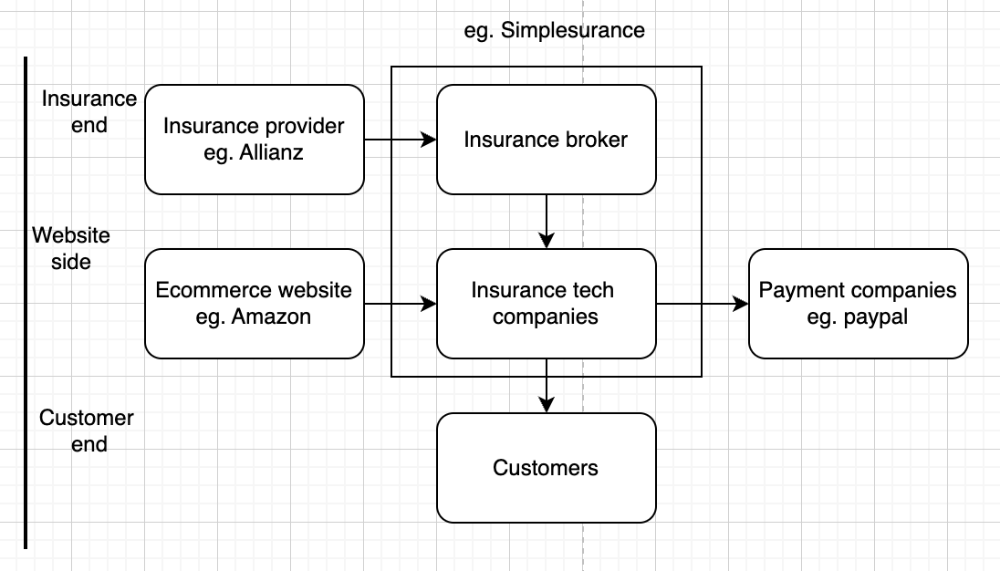

# *Introduction of Part 1:*

*There is a new project in the company, called the “Opportunity Model”. A new customer registering within the*
*Simplesurance Broker App offers a new insurance - an opportunity.* 

*In the following tasks, in case of doubt, use your assumptions.*

## Task 1 :

*Please think about 4 major KPIs for tracking the performance of this project. Create an example of a dashboard where*
*you would present the results.*

Step 1: Understanding of the key stakeholders



Assuming there is no trial for our product else: the trial-to-completion rate

assuming there is a direct buy of insurance product and no steps later else: onboarding to insurance completion rate

keypoint for matrics : 

- we should not lose our customers and our partners  and also earn money for which :
- all stakeholders should be happy.
- integration is done well.
- users are buying our product
- *Simplesurance* should earn money.

**Important KPI with different stakeholders**

## Partnership Satisfaction

 how is integrating our services and our insurance providers affecting the website provider 

[this we are avoiding as there is a limit of 4 but this is also an important one]

## 1. Customer Satisfaction /Retention :**policy activation rate**

**other metrics :**  customer satisfaction rate, customer retention rate, customer churn rate

> if the policy is not activated and activated once solved properly then customer retention will be low since customer satisfaction rate is the best metric to avoid lags in the count but policy activation rate is the most easily gettable one, and it is not as laggy as the customer churn rate
> 

> suppose users are not happy first, they will leave which will decrease the policy activation rate suppose users don't find the insurance they will leave  which will decrease the policy activation rate
> 

## 2. Smooth website Integration : **Tech integration error rate**

> how many errors are occurring technically in our new product integration: payments, website: bad integration leads to lower product sales
> 

## 3. User Usage : Conversion rate on Different Platforms

we have different platforms and different products:  on the products we are offering our insurance how many of those are bought with and without insurance on different platforms

## 4. Simplesurance monetry profit: CLTV/CAC

The Customer Lifetime Value to Customer Acquisition Cost ratio (CLTV/CAC) is a crucial metric in marketing and business analysis, indicating the total value a company expects from a customer compared to the cost of acquiring them. 

**Average Order Value (AOV) can also be used and it will depend on the product attached with insurance too**

> note : from the insurance, we can check the policy renewal rate and claim settlement rate later stage
> 

---

---

---

## Example Dashboard


link of dashboard : https://drive.google.com/file/d/1j-HRllAxlrnvT2ZukSO2CEhf0ansCTGL/view?usp=sharing

link of csv : https://docs.google.com/spreadsheets/d/1fRWPDnQsH-jSOR0E9lGAyZpRkmPkXKRd/edit?usp=drive_link&ouid=107396944281020603446&rtpof=true&sd=true

******************************************************************

**Task 2 :** 

 *Please think about a data model for your dashboard. Create examples of SQL statements for the KPIs you proposed*
*using ”dummy” data for them. You can use 2,3 rows per table. You need to create data yourself. Show how you would combine the tables created. Use SQL to present results, and show off your skills.*

### **Tables:**

1. **Customers**
    - CustomerID (Primary Key)
    - name
    - age
    - city
    - country
    - login devices
    - SignupDate
    - IsActive
    - Isappistalled
2. **Policies**
    - PolicyID (Primary Key)
    - CustomerID (Foreign Key)
    - DateIssued
    - DateActivated
    - DateCancelled
    - Premium
    - CoverageAmount
    - is_active
    - is_used
    - no_of_times_used
    - LastRenewalDate
    - renewel count
3. **Interactions**
    - InteractionID (Primary Key)
    - CustomerID (Foreign Key)
    - Channel used
    - InteractionDate
    - InteractionType (e.g., Call, Email, Web)
    - IssueResolved (Boolean)
    - SatisfactionScore (After interaction survey score)
4. **Sales Transactions**
    - TransactionID (Primary Key)
    - CustomerID (Foreign Key)
    - DateOfTransaction
    - Amount
    - IsWithInsurance (Boolean)
    - Platform
    - Device (e.g., Mobile, Laptop)
    - ProductID
5. **Products**
    - ProductID (Primary Key)
    - Product type
    - InsuranceOffered (Boolean)
    - year of service
6. **Technical Issues**
    - IssueID (Primary Key)
    - DateReported
    - SystemComponent (e.g., Payment, Website)
    - Severity
    - IsResolved (Boolean)
    - Resolution time
    
7. **FinancialMetricsCustomer[need to be created using sql]**
    - FinancialID (Primary Key)
    - CustomerID (Foreign Key)
    - DateMeasured
    - ARPU
    - CLTV (Calculated Customer Lifetime Value)
    - CAC (Customer Acquisition Cost)
    - AOV (Average Order Value, aggregated from SalesTransactions)
8. MarketingExpenses
- ExpenseID
- DateSpent
- Amount
- CampaignName
- TargetAudience
- NumberOfNewCustomersAcquired


```jsx
CREATE TABLE MarketingExpenses (
ExpenseID INT PRIMARY KEY,
DateSpent DATE,
Amount DECIMAL(10, 2),
CampaignName VARCHAR(255),
TargetAudience VARCHAR(255),
NumberOfNewCustomersAcquired INT
);
```


```jsx
CREATE TABLE Customers (
CustomerID INT PRIMARY KEY,
Name VARCHAR(255),
Age INT,
LoginDevices VARCHAR(255),
SignupDate DATE,
IsActive BOOLEAN
);
```

```jsx
CREATE TABLE Policies (
PolicyID INT PRIMARY KEY,
CustomerID INT,
DateIssued DATE,
DateActivated DATE,
DateCancelled DATE,
Premium DECIMAL(10, 2),
CoverageAmount DECIMAL(10, 2),
IsActive BOOLEAN,
IsUsed BOOLEAN,
NoOfTimesUsed INT,
FOREIGN KEY (CustomerID) REFERENCES Customers(CustomerID)
);
```

```jsx
CREATE TABLE Interactions (
InteractionID INT PRIMARY KEY,
CustomerID INT,
InteractionDate DATE,
InteractionType VARCHAR(50),
IssueResolved BOOLEAN,
SatisfactionScore INT,
FOREIGN KEY (CustomerID) REFERENCES Customers(CustomerID)
);
```

```jsx
CREATE TABLE SalesTransactions (
TransactionID INT PRIMARY KEY,
CustomerID INT,
DateOfTransaction DATE,
Amount DECIMAL(10, 2),
IsWithInsurance BOOLEAN,
Platform VARCHAR(50),
Device VARCHAR(50),
ProductID INT,
FOREIGN KEY (CustomerID) REFERENCES Customers(CustomerID),
FOREIGN KEY (ProductID) REFERENCES Products(ProductID)
);
```

```jsx
CREATE TABLE Products (
ProductID INT PRIMARY KEY,
ProductType VARCHAR(255),
InsuranceOffered BOOLEAN,
YearOfService INT
);
```

```jsx
CREATE TABLE TechnicalIssues (
IssueID INT PRIMARY KEY,
DateReported DATE,
SystemComponent VARCHAR(255),
Severity INT,
IsResolved BOOLEAN
);
```

```jsx
CREATE TABLE FinancialMetricsCustomer (
FinancialID INT PRIMARY KEY,
CustomerID INT,
DateMeasured DATE,
FOREIGN KEY (CustomerID) REFERENCES Customers(CustomerID)
-- CLTV, CAC, and AOV are calculated fields and are not stored as columns
);
```

```jsx
calculating  CLTV CAC AOV for financial metrics
```

```jsx
- Example SQL to calculate CLTV and CAC for a single customer
-- This is a simplistic representation and assumes you have all the required data
```

```jsx
- Calculate AOV first (since it's used in CLTV)
WITH CustomerAOV AS (
SELECT
CustomerID,
AVG(Amount) AS AOV
FROM
SalesTransactions
GROUP BY
CustomerID
),
CustomerCLTV AS (
SELECT
c.CustomerID,
(a.AOV * COUNT(t.TransactionID)) / NULLIF(COUNT(p.PolicyID), 0) AS CLTV
FROM
Customers c
JOIN
CustomerAOV a ON c.CustomerID = a.CustomerID
LEFT JOIN
SalesTransactions t ON c.CustomerID = t.CustomerID
LEFT JOIN
Policies p ON c.CustomerID = p.CustomerID AND p.DateCancelled IS NOT NULL
GROUP BY
c.CustomerID, a.AOV
),
CustomerCAC AS (
SELECT
CustomerID,
-- Assuming the CAC is pre-calculated or derived from another data source
(SELECT AVG(CAC) FROM MarketingExpenses) AS CAC
FROM
Customers
)
INSERT INTO FinancialMetricsCustomer (CustomerID, DateMeasured, CLTV, CAC, AOV)
SELECT
cltv.CustomerID,
CURRENT_DATE AS DateMeasured,
cltv.CLTV,
cac.CAC,
aov.AOV
FROM
CustomerCLTV cltv
JOIN
CustomerCAC cac ON cltv.CustomerID = cac.CustomerID
JOIN
CustomerAOV aov ON cltv.CustomerID = aov.CustomerID;
```


```jsx
MASTER TABLE example :
customer id | product id | policy id | amount | date |is_active| cancellation date| device used 
```

**for other parts please refer notebook :** https://drive.google.com/file/d/1iPLZrbbtND5q-Mkp639IiLJaQet2pra5/view?usp=drive_link

### 

### Task 3 : *improve the code below and provide short reasoning.*

original code

```jsx
*Please improve the code below and provide short reasoning.*
*connection = psycopg2.connect(user="simplesurance",*
*password="simplesurance@#29",*
*host="127.0.0.1",*
*port="5432",*
*database="postgres_db")*
*cursor = connection.cursor()*
*record = cursor.fetchone()*
*create_table_query = '''CREATE TABLE mobile*
*(ID INT PRIMARY KEY NOT NULL,*
*MODEL TEXT NOT NULL,*
*itemPRICE REAL*
*created_date datetime);'''*
*cursor.execute(create_table_query)*
```

# Code changes

```python
import psycopg2
from psycopg2 import extras
1**. Use context managers for automatic connection/cursor closure
with** psycopg2.connect(user="simplesurance", password="simplesurance@#29", host="127.0.0.1", port="5432", database="postgres_db") as connection:
with connection.cursor(cursor_factory=extras.DictCursor) as cursor:
**# 2. Ensures transactional integrity
connection.autocommit = False**
try:
# 3. Correct data type and query structure, 4. Table Existence Check
create_table_query = '''
CREATE TABLE **IF NOT EXISTS** mobile (
ID **SERIAL** PRIMARY KEY,  -- 5. Using SERIAL for auto-incrementing IDs
MODEL TEXT NOT NULL,
itemPRICE **NUMERIC**,  -- 6. Using NUMERIC for financial figures
created_date **TIMESTAMP DEFAULT CURRENT_TIMESTAMP  -**- 7. TIMESTAMP with DEFAULT
);'''
cursor.execute(create_table_query)
**connection.commit()  # 8. Commit the transaction**
print("Table created successfully.")
**except psycopg2.Error as e:
print(f"An error occurred: {e}")
connection.rollback()  # 9. Roll back in case of error**
```

# Issue resolved

Several potential failure points from the original:

1. **Resource Leaks**: The original code could fail to release database connections and cursors in case of exceptions, leading to resource leaks. The improved code uses context managers to ensure proper closure.
2. **Data Integrity**: Without transaction management, partial updates could occur on failure, leading to data inconsistencies. The improved version uses explicit transactions, allowing for rollbacks in case of errors.
3. **Error Handling**: The initial script lacked structured error handling, which could cause the program to crash on exceptions. The revised code includes try-except blocks for graceful error handling.
4. **Schema Conflicts**: Attempting to create a table that already exists without checking could cause errors. The **`IF NOT EXISTS`** clause prevents such conflicts.
5. **Data Type Precision**: The use of **`REAL`** for financial data could lead to precision loss. The improved script uses **`NUMERIC`** for precise financial calculations.
6. **Automatic Value Assignment**: The original **`ID`** field required manual entry, which could lead to errors or conflicts. The **`SERIAL`** type in the improved script automates ID assignment.

Each change mitigates specific risks and improves the robustness and reliability of the database operation.

**all files can be found here** : [https://drive.google.com/drive/folders/1YlLN_wN7cg9WCeeM53-pWuCr5GNYX9oq?usp=sharing](https://drive.google.com/drive/folders/1YlLN_wN7cg9WCeeM53-pWuCr5GNYX9oq?usp=sharing)
